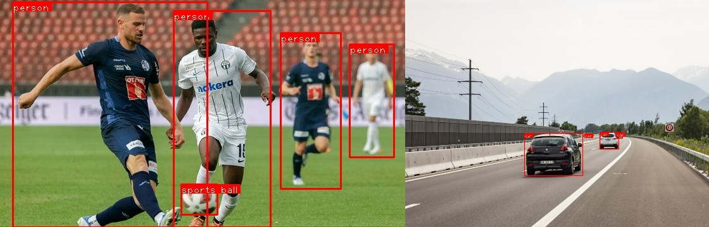

# Yolo v3 pytorch implementation

## Output results



## How to test the code 

First of all, you need to download the weights from the official. Then you need to install the required python packages to run the code.

```bash
wget https://pjreddie.com/media/files/yolov3.weights
```

There are two kind of wrapper for this algorithm. You can run the code with camera input or run the code and perform inference on all images_present in the input folder.

### With the camera

``` bash
 python camera.py
```

### With images in the folder

In this case you need to 

```
python main.py
```

or by running the notebook demo.ipynb


#### Sources

I used some part of this code and took insipiration from this implementation to learn how yolo works.
https://www.kaggle.com/code/arunmohan003/yolo-v3-pytorch-tutorial-from-scratch

